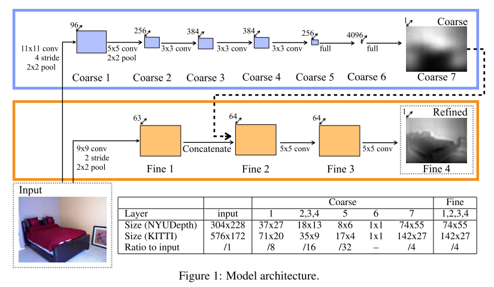

This repository contains the reproduce codes for the paper [Depth Map Prediction from a Single Image using a Multi-Scale Deep Network](https://www.cs.nyu.edu/~deigen/depth/). 

# Guide

### model folder
contains CNN Network architecture definition based on tensorflow.

### train.py
class Train_Flags: contains some training parameters set 
function train: build the network and do training.

